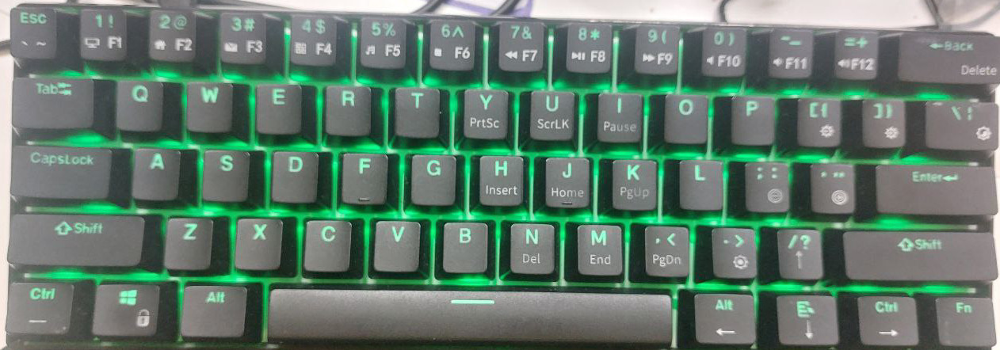

# My Keyboard Layouts and Configurations

This repository stores my custom keyboard layouts and configurations managed using [usevia.app](https://usevia.app/). It also includes the necessary vendor definition files for the keyboards I own.

Storing these files here provides version control, easy backup, and portability across different machines.

## Keyboards Included:

* RK ROYAL KLUDGE RK61 Wired 60% Mechanical Gaming Keyboard
* Nuphy Air75 V2 Portable 75% Mechanical Keyboard

## Repository Structure:

```

.
├── README.md
├── keyboard\_models/
│   ├── nuphy\_air75\_v2/
│   │   ├── vendor\_definition/  \# Vendor JSON file(s)
│   │   └── custom\_layouts/     \# My exported layout JSON files
│   └── rk\_rk61/
│       ├── vendor\_definition/  \# Vendor JSON file(s)
│       ├── custom\_layouts/     \# My exported layout JSON files
│       └── images/              \# Pictures of the keyboard, layout and layers

```

* **`vendor_definition/`**: Contains the JSON files provided by the keyboard vendor or community that allow usevia.app to load the keyboard's definition. You might need to manually load these in VIA's "Design" tab or use the "Load saved definition" option if the keyboard isn't automatically detected.
* **`custom_layouts/`**: Contains the JSON files I export from usevia.app after configuring your keymaps, layers, and settings. You can load these using the "Load saved layout" option in usevia.app's "Configure" tab.
* **`images/`**: Contains pictures of the keyboard(s), useful for visual reference.

## Images:


### RK ROYAL KLUDGE RK61 (Original Keycaps)



## How to Use:

1.  Clone this repository to your local machine.
2.  Open [usevia.app](https://usevia.app/) in your browser.
3.  Connect your keyboard.
4.  If the keyboard isn't automatically recognized, go to the "Design" tab (you might need to enable the "Design" tab in the settings) and load the appropriate JSON file from the `vendor_definition/` directory for your keyboard.
5.  Go to the "Configure" tab and load your desired layout from the `custom_layouts/` directory for your keyboard using the "Load saved layout" button.

